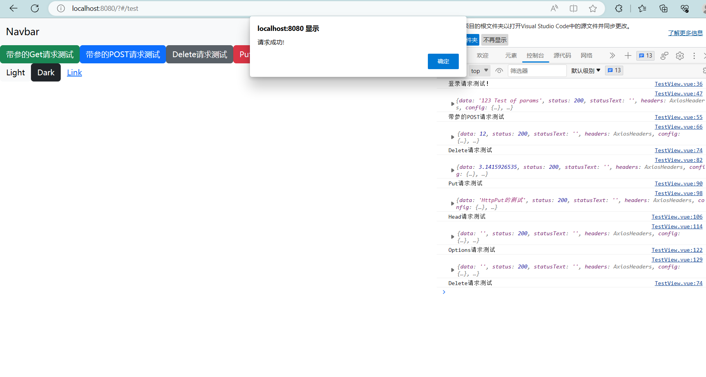

by fenye7 2023-7-6

# 本次在7.6的基础上将常用的http请求方式的demo上传

1. * 根据昨天文档中的操作做了一个test页面，启动前端就可以看到
   * 页面中几个按钮分别对应不同的接口，每次点击发送一次请求
   * 你在运行demo时请同时在你的本机上运行前后端进程，以便数据通信
   * 在前端运行的浏览器中请右键打开浏览器的检查功能，切换到"console"页，这样你可以看到请求的结果，是否成功
   * 最终的效果应该是：
   

2. 补充昨天文档中未说明的一点：
   在后端项目中的配置（启动）文件Program.cs中请引入Cors实现跨域请求，否则会报错（因为你前端运行在本机的位置通常是：http://localhost:8080, 但是后端生成的部署是 https://localhost:5001）

   处理这个跨域请求的方式是在配置文件中如下配置：
   （**ps:具体的其他配置我尚未弄得很清楚，边写边学吧**）
   ```{c#}
   var builder = WebApplication.CreateBuilder(args);
   // Add services to the container.
   builder.Services.AddControllersWithViews();
   var app = builder.Build();
   // Configure the HTTP request pipeline.
   if (!app.Environment.IsDevelopment())
   {
       app.UseExceptionHandler("/Home/Error");
       // The default HSTS value is 30 days. You may want to change this for production scenarios, see https://aka.ms/aspnetcore-hsts.
       app.UseHsts();
    }
    app.UseHttpsRedirection();
    app.UseStaticFiles();
    app.UseCors(builder =>
    {  //关键就是这个，定义构建时允许所有的域访问
        builder.WithOrigins("http://localhost:8080")
        .AllowAnyHeader()
        .AllowAnyMethod();
    });
    app.UseRouting();
    app.UseAuthentication();
    app.UseAuthorization();
    app.UseEndpoints(endpoints =>
    {
        endpoints.MapControllers();
    });
    app.MapControllerRoute(
        name: "default",
        pattern: "{controller=Home}/
        action=Index}/{id?}");
    app.Run();  
```